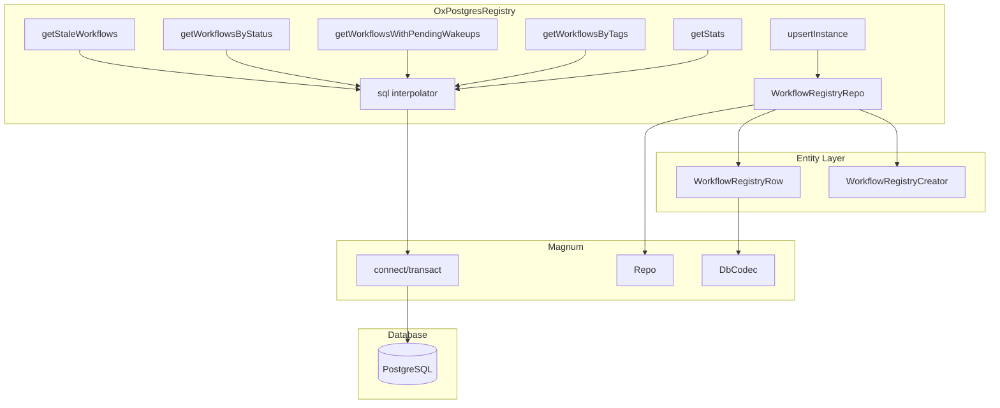

# Design Document: OxPostgresRegistry Magnum Repo Refactor

## Overview

This design describes the refactoring of `OxPostgresRegistry` from raw JDBC queries to Magnum's `Repo` pattern. The refactoring leverages Magnum's compile-time code generation for common database operations while simplifying JSON handling by treating JSONB columns as strings at the repository level.

The key changes are:
1. Define entity classes with `@Table` annotation for compile-time repository generation
2. Replace raw JDBC connection management with Magnum's `connect` context
3. Handle tags as JSON strings in the entity, with serialization/deserialization at the service layer
4. Use Magnum's `sql` interpolator for custom queries (upsert, filtering)

## Architecture



## Components and Interfaces

### Entity Classes

#### WorkflowRegistryRow

The main entity class representing a row in the `workflow_registry` table:

```scala
@Table(PostgresDbType, SqlNameMapper.CamelToSnakeCase)
case class WorkflowRegistryRow(
    templateId: String,
    instanceId: String,
    status: String,
    createdAt: Instant,
    updatedAt: Instant,
    wakeupAt: Option[Instant],
    tags: Option[String]  // JSON string, not Map
) derives DbCodec

object WorkflowRegistryRow:
  // Composite primary key type
  type Id = (String, String)  // (templateId, instanceId)
```

#### WorkflowRegistryCreator

Entity-creator class for insert operations (same fields since no auto-generated columns):

```scala
case class WorkflowRegistryCreator(
    templateId: String,
    instanceId: String,
    status: String,
    createdAt: Instant,
    updatedAt: Instant,
    wakeupAt: Option[Instant],
    tags: Option[String]
) derives DbCodec
```

### Repository

The repository is defined using Magnum's `Repo` class:

```scala
object WorkflowRegistryRepo extends Repo[WorkflowRegistryCreator, WorkflowRegistryRow, (String, String)]
```

This generates methods like:
- `findById(id: (String, String)): Option[WorkflowRegistryRow]`
- `findAll: Vector[WorkflowRegistryRow]`
- `insert(creator: WorkflowRegistryCreator): Unit`
- `update(entity: WorkflowRegistryRow): Unit`
- `delete(entity: WorkflowRegistryRow): Unit`

### OxPostgresRegistry (Refactored)

The main class uses the repository and Magnum's `connect` context:

```scala
class OxPostgresRegistry(
    transactor: Transactor,
    tableName: String = "workflow_registry",
    clock: Clock = Clock.systemUTC(),
    tagger: Option[Tagger[Any]] = None,
) extends WorkflowRegistry.Agent[Direct] {

  private val repo = WorkflowRegistryRepo

  override def upsertInstance(
      inst: ActiveWorkflow[?, ?],
      executionStatus: ExecutionStatus,
  ): Direct[Unit] = Direct {
    connect(transactor) {
      // Use sql interpolator for upsert with ON CONFLICT
      val row = buildRow(inst, executionStatus)
      sql"""
        INSERT INTO workflow_registry 
          (template_id, instance_id, status, created_at, updated_at, wakeup_at, tags)
        VALUES (${row.templateId}, ${row.instanceId}, ${row.status}, 
                ${row.createdAt}, ${row.updatedAt}, ${row.wakeupAt}, ${row.tags}::jsonb)
        ON CONFLICT (template_id, instance_id) DO UPDATE SET
          status = EXCLUDED.status,
          updated_at = EXCLUDED.updated_at,
          wakeup_at = EXCLUDED.wakeup_at,
          tags = COALESCE(EXCLUDED.tags, workflow_registry.tags)
      """.update.run()
    }
  }
  
  // Query methods use sql interpolator within connect block
  def getStaleWorkflows(notUpdatedFor: FiniteDuration): Direct[List[WorkflowInstanceId]] = Direct {
    val cutoffTime = Instant.now(clock).minusMillis(notUpdatedFor.toMillis)
    connect(transactor) {
      sql"""
        SELECT template_id, instance_id
        FROM workflow_registry
        WHERE status = 'Running' AND updated_at <= $cutoffTime
        ORDER BY updated_at ASC
      """.query[(String, String)].run().map { case (t, i) => 
        WorkflowInstanceId(t, i) 
      }.toList
    }
  }
}
```

### Tag Serialization

Tags are serialized/deserialized at the service layer:

```scala
private def serializeTags(tags: Option[Map[String, String]]): Option[String] =
  tags.filter(_.nonEmpty).map(MagnumJsonCodec.writeJsonString)

private def deserializeTags(json: Option[String]): Option[Map[String, String]] =
  json.map(MagnumJsonCodec.readJsonString).filter(_.nonEmpty)
```

## Data Models

### Database Schema (Unchanged)

```sql
CREATE TABLE IF NOT EXISTS workflow_registry (
    instance_id TEXT      NOT NULL,
    template_id TEXT      NOT NULL,
    status      TEXT      NOT NULL CHECK (status IN ('Running', 'Awaiting', 'Finished')),
    created_at  TIMESTAMP NOT NULL,
    updated_at  TIMESTAMP NOT NULL,
    wakeup_at   TIMESTAMP,
    tags        JSONB,
    PRIMARY KEY (template_id, instance_id)
);
```

### Entity to Database Mapping

| Scala Field | Database Column | Type Mapping |
|-------------|-----------------|--------------|
| templateId | template_id | String → TEXT |
| instanceId | instance_id | String → TEXT |
| status | status | String → TEXT |
| createdAt | created_at | Instant → TIMESTAMP |
| updatedAt | updated_at | Instant → TIMESTAMP |
| wakeupAt | wakeup_at | Option[Instant] → TIMESTAMP |
| tags | tags | Option[String] → JSONB (cast) |

### DbCodec Requirements

The following DbCodecs are needed:
- `DbCodec[Instant]` - existing, converts via `java.sql.Timestamp`
- `DbCodec[String]` - built-in
- `DbCodec[Option[T]]` - built-in for any T with DbCodec


## Correctness Properties

*A property is a characteristic or behavior that should hold true across all valid executions of a system—essentially, a formal statement about what the system should do. Properties serve as the bridge between human-readable specifications and machine-verifiable correctness guarantees.*

### Property 1: Tag Serialization Round-Trip

*For any* `Map[String, String]` representing workflow tags, serializing to JSON string and then deserializing back should produce an equivalent map.

**Validates: Requirements 3.1, 3.2**

### Property 2: Upsert Correctness

*For any* workflow instance and execution status, after calling `upsertInstance`:
- If the instance did not exist, a new row should be created with the correct values
- If the instance already existed, the row should be updated with the new status, updated_at, wakeup_at, and tags
- The resulting row should have the expected field values

**Validates: Requirements 4.1, 4.2, 4.3**

### Property 3: Tag Preservation on NULL Update

*For any* existing workflow with non-null tags, upserting with NULL tags should preserve the existing tags (COALESCE behavior).

**Validates: Requirements 4.4**

### Property 4: Stale Workflow Filtering

*For any* set of workflows with various statuses and update timestamps, `getStaleWorkflows(duration)` should return exactly those workflows where:
- status = 'Running'
- updated_at <= (now - duration)

**Validates: Requirements 5.1**

### Property 5: Status Filtering

*For any* set of workflows with various statuses, `getWorkflowsByStatus(status)` should return exactly those workflows matching the specified status.

**Validates: Requirements 5.2**

### Property 6: Pending Wakeup Filtering

*For any* set of workflows with various wakeup times and statuses, `getWorkflowsWithPendingWakeups(asOf)` should return exactly those workflows where:
- wakeup_at IS NOT NULL
- wakeup_at <= asOf
- status IN ('Running', 'Awaiting')

**Validates: Requirements 5.3**

### Property 7: Tag Containment Filtering

*For any* set of workflows with various tags and any tag filter map, `getWorkflowsByTags(filter)` should return exactly those workflows whose tags contain all key-value pairs in the filter.

**Validates: Requirements 5.4**

### Property 8: Stats Aggregation Correctness

*For any* set of workflows, `getStats` should return:
- total = count of all workflows
- running = count where status = 'Running'
- awaiting = count where status = 'Awaiting'
- finished = count where status = 'Finished'
- oldestRunning = MIN(updated_at) where status = 'Running'
- newestRunning = MAX(updated_at) where status = 'Running'

**Validates: Requirements 5.5**

### Property 9: Instant Codec Round-Trip

*For any* `java.time.Instant`, converting to `java.sql.Timestamp` and back should produce an equivalent Instant (within millisecond precision).

**Validates: Requirements 6.1**

## Error Handling

### Database Connection Errors

- Connection failures are propagated as exceptions through the `Direct` effect
- Magnum's `connect` handles connection lifecycle automatically
- HikariCP provides connection pool exhaustion handling with configurable timeouts

### Serialization Errors

- Invalid JSON in tags column: `MagnumJsonCodec.readJsonString` returns empty map on parse failure
- Null handling: `Option[String]` naturally handles NULL database values

### Constraint Violations

- Primary key conflicts: Handled by `ON CONFLICT DO UPDATE` clause
- Status check constraint: Invalid status values will cause database constraint violation

### Transaction Handling

- Simple operations use auto-commit through `connect`
- Complex operations requiring atomicity should use `transact` instead

## Testing Strategy

### Property-Based Testing

Property-based tests will use **ScalaCheck** integrated with **ScalaTest** to verify the correctness properties defined above.

**Configuration:**
- Minimum 100 iterations per property test
- Each test tagged with: `Feature: ox-magnum-repo-refactor, Property N: {property_text}`

**Test Structure:**
```scala
class OxPostgresRegistryPropertySpec extends AnyFreeSpec with ScalaCheckPropertyChecks with OxMagnumTestSuite {
  
  // Property 1: Tag serialization round-trip
  "Tag serialization" - {
    "round-trip preserves data" in {
      forAll { (tags: Map[String, String]) =>
        val serialized = MagnumJsonCodec.writeJsonString(tags)
        val deserialized = MagnumJsonCodec.readJsonString(serialized)
        deserialized shouldBe tags
      }
    }
  }
  
  // Property 2-8: Database properties require test container
  // ...
}
```

### Unit Tests

Unit tests verify specific examples and edge cases:

1. **Empty tags handling**: Verify NULL is stored when tags are empty
2. **Status enum mapping**: Verify correct string conversion for each ExecutionStatus
3. **Timestamp precision**: Verify Instant conversion maintains millisecond precision
4. **JSONB query syntax**: Verify containment queries work with PostgreSQL

### Integration Tests

Integration tests use TestContainers with PostgreSQL to verify:

1. Schema compatibility with entity classes
2. Upsert behavior with real database
3. Query methods return correct results
4. Connection pool behavior under load

### Test Dependencies

```scala
libraryDependencies ++= Seq(
  "org.scalacheck" %% "scalacheck" % "1.17.0" % Test,
  "org.scalatestplus" %% "scalacheck-1-17" % "3.2.18.0" % Test,
  "com.dimafeng" %% "testcontainers-scala-postgresql" % "0.41.0" % Test
)
```
