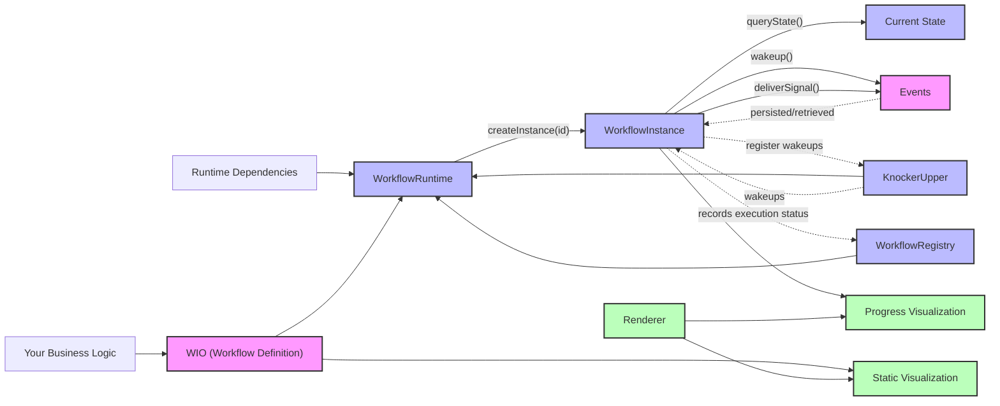

# Workflows4s Architecture

## System Components

The diagram below illustrates the key components of Workflows4s and their relationships:

## Key Concepts

### Core Components

- **Your Business Logic**: Your application code that defines the workflow steps and business rules.
- **WIO (Workflow Definition)**: A pure value object that describes the workflow structure, e.g.:
    - Steps (computations)
    - Signal handling
    - Timers
    - Branching

### Runtime Components

- **WorkflowRuntime**: Manages workflow instances and their execution.
- **Runtime Dependencies**: External services required by the runtime (e.g., event storage).
- **WorkflowInstance**: A specific execution of a workflow with a unique ID.
- **Events**: Persistent records of all actions and state changes in the workflow.
- **KnockerUpper**: Responsible for waking up workflows at scheduled times, handling timer-based operations.
- **WorkflowRegistry**: Keeps track of executed instances and their execution status.

### Interaction Methods

- **createInstance**: Creates a new workflow instance with a specific ID.
- **queryState**: Retrieves the current state of a workflow instance.
- **wakeup**: Resumes a paused workflow instance.
- **deliverSignal**: Sends external signals to a workflow instance.

### Visualization

- **Renderer**: Converts workflow definitions into visual representations.
- **Static Visualization**: Shows the complete workflow structure before execution.
- **Progress Visualization**: Shows the current state and progress of a running workflow.

## Execution Model

Workflows4s uses an event-sourcing approach:

1. **First Run**: The workflow executes operations along its path, with each operation producing an event that is
   persisted.
2. **Recovery**: After a restart, events are read from storage and applied to rebuild the workflow state without
   re-executing side effects.
3. **Signals**: External events can be delivered to the workflow to trigger state transitions.

This architecture enables workflows to be resilient, recoverable, and visualizable throughout their lifecycle.
