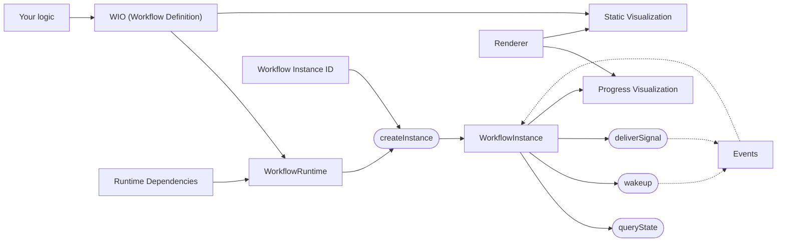

# Workflows4s Anatomy

## What Does It Do?

Workflows4s enables the creation of workflows using the `WIO` data type. A workflow built with `WIO` supports the
following operations, as through the [Workflow Elements](../category/workflow-elements):

- **Running side-effectful computations**
- **Receiving signals** from the external world
- **Querying workflow state** at any time
- **Recovering workflow state** without re-triggering side-effecting operations

`WIO` is a pure value object that describes the workflow. However, to execute it, you need a [runtime](../runtimes)
capable of:

- Persisting events in a journal
- Reading events from the journal

## How Does It Work?

### First Run

1. The workflow executes `IO`s along its path. Each `IO` produces an event that is persisted in the journal.
2. Event handlers can modify the workflow state based on the events.
3. The workflow halts execution when a signal or a timer is expected and resumes once the conditions are met.

### Recovery (e.g., After a Service Restart)

1. Events are read from the journal and applied to the workflow.
2. All previously executed `IO`s and received signals are skipped if corresponding events are already registered.
3. Once all events are processed, the workflow continues execution as normal.
