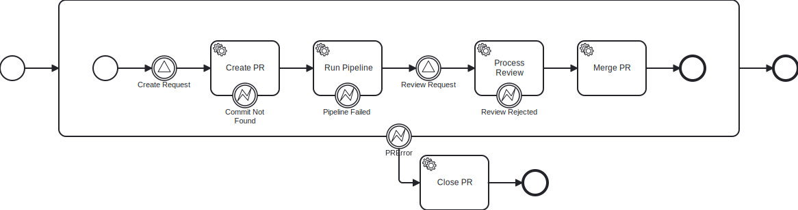

# Getting Started

:::info

As of now, Workflows4s don't have a realease. The guide below aims at showcasing the basic ideas behind the library but
to follow it you need to either release the code locally or write it inside `workflows4s-example` project.

:::

Let's model a simplified pull request process that looks like this:

1. Run CI/CD pipeline
2. Close the Pr if critical issue detected ine the pipeline
2. Await approval
3. Merge if approved, close otherwise
3. Allow closing the PR at any point

## Modeling the workflow

We will start by defining our workflow context, that controls types internal to the workflow: its state and events it
uses for persistance. Those won't bother us for now because they are not important in the early phase of designing the
workflow.


<!-- @formatter:off -->
```scala file=./main/scala/workflow4s/example/docs/pullrequest/PullRequestWorkflow.scala start=start_context end=end_context
```
<!-- @formatter:on -->

Now we can define the shape of our workflow.

<!-- @formatter:off -->
```scala file=./main/scala/workflow4s/example/docs/pullrequest/PullRequestWorkflow.scala start=start_steps end=end_steps
```
<!-- @formatter:on -->

This is enough to generate the graphical representation!

<!-- @formatter:off -->
```scala file=./main/scala/workflow4s/example/docs/pullrequest/PullRequestWorkflow.scala start=start_render end=end_render
```
<!-- @formatter:on -->

Tada!




## Running the workflow

:::note

Unfortunately, this part of the documentation is not ready yet.

:::