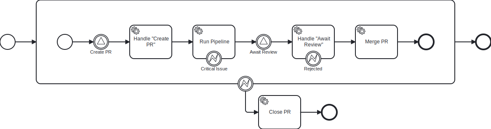

import SbtDependency from "@site/src/components/SbtDependency";

# Intro

:::info

Workflows4s is a freshly released library. Please check [Production Readiness](other/production-readiness/) for details.

:::

To give a glimpse into the library, we will model a simplified pull request process that looks like this:

1. Run CI/CD pipeline
2. Close the PR if critical issue detected in the pipeline
2. Await approval
3. Merge if approved, close otherwise

### Dependency

<SbtDependency moduleName={"workflows4s-core"} />

## Modeling the workflow

We will start by defining our workflow context. It controls types internal to the workflow: its state and events it uses
for persistance. Those won't bother us for now because they are not important in the early phase of designing the
workflow.


<!-- @formatter:off -->
```scala file=./main/scala/workflows4s/example/docs/pullrequest/PullRequestWorkflowDraft.scala start=start_context end=end_context
```
<!-- @formatter:on -->

Now we can define the shape of our workflow.

<!-- @formatter:off -->
```scala file=./main/scala/workflows4s/example/docs/pullrequest/PullRequestWorkflowDraft.scala start=start_steps end=end_steps
```
<!-- @formatter:on -->

This is enough to generate the graphical representation!

<!-- @formatter:off -->
```scala file=./main/scala/workflows4s/example/docs/pullrequest/PullRequestWorkflowDraft.scala start=start_render end=end_render
```
<!-- @formatter:on -->

Tada!



## Implementing the workflow

Let's now implement our workflow. We have to start with defining the few underlying ADTs: state, events, errors and
signals. Normally, you will define those as you go through the process od defining the steps, but for the sake of this
tutorial, we are defining them upfront.

<!-- @formatter:off -->
```scala file=./main/scala/workflows4s/example/docs/pullrequest/PullRequestWorkflow.scala start=start_state end=end_state
```
<!-- @formatter:on -->

Workflows4s was designed to be as type-safe as possible. It means we can express the state as an ADT and the compiler
will allow us to compose steps transitioning through those states only in the correct order.

<!-- @formatter:off -->
```scala file=./main/scala/workflows4s/example/docs/pullrequest/PullRequestWorkflow.scala start=start_events end=end_events
```
<!-- @formatter:on -->

Workflows4s is built on the idea of event-sourcing, and each non-deterministic action
(e.g. IO) is memoized through an event. Those events are used to recompute the workflow state upon recovery.

<!-- @formatter:off -->
```scala file=./main/scala/workflows4s/example/docs/pullrequest/PullRequestWorkflow.scala start=start_signals end=end_signals
```
<!-- @formatter:on -->

Signals are the API of a workflow, they allow delivering information into the workflow and get some response back. In
our example, we don't leverage the response part.

<!-- @formatter:off -->
```scala file=./main/scala/workflows4s/example/docs/pullrequest/PullRequestWorkflow.scala start=start_error end=end_error
```
<!-- @formatter:on -->

Workflows4s supports short-circuiting operations with domain errors. The mechanism is similar to Either or bi-functor IO
and different parts of the workflow can use different errors. In this example, we use just one. All errors will be
visible in type signatures.

Now that we have it covered, we can plug state and events into our context and start defining the steps.
<!-- @formatter:off -->
```scala file=./main/scala/workflows4s/example/docs/pullrequest/PullRequestWorkflow.scala start=start_context end=end_context
```
<!-- @formatter:on -->

Our first step creates the PR reacting to the previously defined signal.

<!-- @formatter:off -->
```scala file=./main/scala/workflows4s/example/docs/pullrequest/PullRequestWorkflow.scala start=start_steps_1 end=end_steps_1
```
<!-- @formatter:on -->

We handled the signal without side effects and added dummy validation logic in the event handler. In real life, we could
do the lookup in git to verify commits existence and emit different events based on the outcome of that lookup.

`voidResponse` produces unit value as signal response. `autoNamed` fills the name of the step based on the variable
name.

Step definitions are verbose by design, because they are not lightweight things. Each step in the workflow adds
complexity and mental load. The workflow should have as few steps as possible.

In the next 2 steps, we run a fake side-effectful computation and handle the review signal.

<!-- @formatter:off -->
```scala file=./main/scala/workflows4s/example/docs/pullrequest/PullRequestWorkflow.scala start=start_steps_2 end=end_steps_2
```
<!-- @formatter:on -->

With this being done, we can finish the workflow.

<!-- @formatter:off -->
```scala file=./main/scala/workflows4s/example/docs/pullrequest/PullRequestWorkflow.scala start=start_steps_3 end=end_steps_3
```
<!-- @formatter:on -->

Done!
We defined last to simple steps as pure deterministic computations and composed the steps exactly the same way as in the
draft.

Let's generate the diagram again.

<!-- @formatter:off -->
```scala file=./main/scala/workflows4s/example/docs/pullrequest/PullRequestWorkflow.scala start=start_render end=end_render
```
<!-- @formatter:on -->


Has anything changed? Yes, because the error names are now generated automatically from the defined ADT. Otherwise, its
same process we defined initially.

## Running the workflow

Let's now see how to run the workflow. To do that, we need a [runtime](runtimes). For simplicity’s sake, we will go with
synchronous in-memory runtime.

<!-- @formatter:off -->
```scala file=./main/scala/workflows4s/example/docs/pullrequest/PullRequestWorkflow.scala start=start_execution end=end_execution
```
<!-- @formatter:on -->

And that's pretty much it. Runtime provides us a way to interact with a workflow through delivering signals and querying
the state.

There is one more thing which we can do which is recovering the workflow.

## Recovering the workflow

This is usually a responsibility of the runtime to fetch the events and reconstruct instance from them, but because we
are using in-memory runtime here, we can do this programtically.

<!-- @formatter:off -->
```scala file=./main/scala/workflows4s/example/docs/pullrequest/PullRequestWorkflow.scala start=start_recovery end=end_recovery
```
<!-- @formatter:on -->

We created a new instance and provided the initial events taken from the previous instance. The workflow processed them
and recovered the state without executing any side-effectful operations.

You can find the whole
code [here](https://github.com/business4s/workflows4s/tree/main/workflows4s-example/src/main/scala/workflows4s/example/docs/pullrequest).
