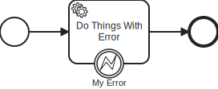

# Running Side Effects

## Without Error

### Code
```scala file=./main/scala/workflows4s/example/docs/RunIOExample.scala start=start_withoutError end=end_withoutError
```

### BPMN


### Model
```json file=./test/resources/docs/run-io.json
```

## With Error

### Code
```scala file=./main/scala/workflows4s/example/docs/RunIOExample.scala start=start_withError end=end_withError
```

### BPMN



### Model
```json file=./test/resources/docs/run-io-error.json
```
