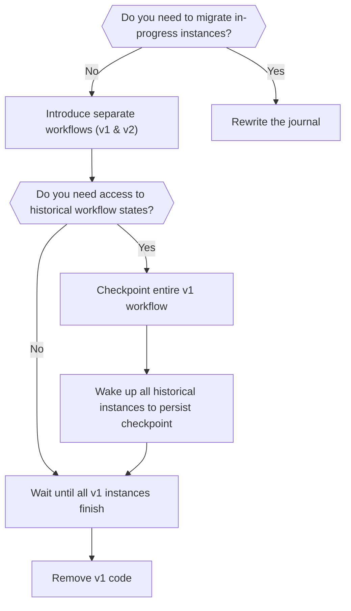

# Evolving Workflows

Workflow evolution is crucial for long-lived systems, especially when workflows are expected to run continuously over extended periods. Workflows4s aims to handle workflow evolution through a combination of strategies:

1. **Checkpointing**: Allows segments of workflows to be marked as stable checkpoints, preventing the need for replaying those parts and enabling easier modifications.
2. **Journal Rewrites**: Enables modifications of the persisted event journal to accommodate workflow changes.
3. **Versioning**: Supports running different workflow versions simultaneously to smoothly handle evolving workflows.

---

## Compatibility Guide

Use the decision flowchart below to determine the optimal strategy for evolving your workflows:

---

## Checkpointing and Recovery

For detailed instructions on checkpointing mechanisms and recovery procedures, visit the [Checkpointing documentation](/docs/operations/checkpoints/).

---

## Impact of Workflow Changes

Below is a detailed explanation of how workflow modifications impact historical (already executed) workflows:

1. **Adding a Step:**
   - The newly added step will execute upon workflow wakeup, and its event will be appended to the end of the journal.
   - Currently, this might lead to incorrect recovery, as events will replay out of the intended order. Future enhancements to persistence/recovery mechanisms might address this issue.

2. **Removing a Step:**
   - Events previously recorded for the removed step will be ignored during recovery.
   - Workflow definition is always subject to typesafety constraints, hence next step input and logic has to accomodate the potentially missing data.

3. **Modifying Events:**
   - Changes to events, either in persisted or runtime form, typically don't affect workflows as long as events remain readable from the journal.

4. **Modifying Behavior:**
   - Functions within workflows (logic execution, state rebuilding, etc.) can safely be altered without backward compatibility concerns, provided the modifications remain logically consistent.

---

## Journal Rewrites

Journal rewrites involve directly altering the persisted event log to achieve a specific evolution outcome. Such operations include modifying, adding, or removing events. Currently, Workflows4s does not directly support journal rewrites due to their inherently complex and system-specific nature. Users performing journal rewrites should do so with caution and thorough testing.

---

## Automated Compatibility Detection (Planned)

Workflows4s may introduce tooling for automated detection of breaking changes, inspired by existing solutions such as [Buf](https://buf.build/docs/breaking/overview/).

Follow the progress and discussion on the dedicated [GitHub issue #48](https://github.com/business4s/workflows4s/issues/48).

